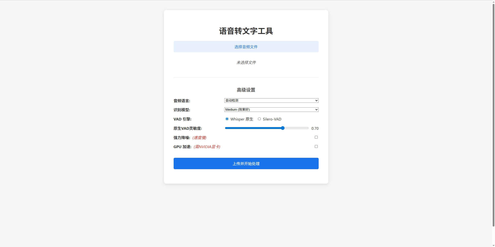

# 🎙️ Whisper-WebUI: 一个功能强大的语音转文字 Web 应用平台

Whisper-WebUI 是一个基于 `stable-ts` (Whisper 的增强版) 构建的、拥有可视化界面的语音转文字工具。它不仅提供了极高的识别准确率，还赋予了用户深度定制识别流程的能力，包括模型选择、VAD引擎切换、降噪模式和GPU加速等。


---

## 📦 可执行版本下载 (推荐)

对于不希望配置 Python 环境的普通用户，我们提供了已打包好的可执行文件，开箱即用。

| 版本 | 适用用户 | 下载链接 | 文件大小 |
| :--- | :--- | :--- | :--- |
| **CPU 版本** | 适用于所有用户，尤其是没有 NVIDIA 显卡的用户。 | [**从 GitHub 下载**](https://github.com/xiaodianqi/Whisper-WebUI/releases) | ~260 MB |
| **GPU 版本** | 需拥有 NVIDIA 显卡，性能更强，速度更快。 | [**从夸克网盘下载**](https://pan.quark.cn/s/e31a94a51a97) | ~2.5 GB |

### 使用方法
双击运行 `.exe` 文件即可！程序会自动在您的默认浏览器中打开应用界面。

---

## 🚀 快速开始 (开发者)

如果你是开发者，并希望从源码运行，请遵循以下步骤。本项目使用 `uv` 进行包和环境管理，它是一个超高速的 `pip` 和 `venv` 替代品。

### 1. 环境准备

- **Python 3.9+**: 建议使用 Python 3.9 或更高版本。
- **Git**: 用于克隆本仓库。
- **ffmpeg**: 本项目依赖 `ffmpeg` 来处理音频文件，请确保你的系统中已经安装了它。
- **(可选) NVIDIA 环境**: 如果你想使用 GPU 加速，请确保你拥有一块 NVIDIA 显卡，并已正确安装最新的 **显卡驱动**。

### 2. 安装 uv

如果你还没有安装 `uv`，请根据你的操作系统运行以下命令：

```sh
# Windows
pip install uv

# macOS / Linux
curl -LsSf https://astral.sh/uv/install.sh | sh
```

### 3. 克隆并进入项目

```sh
git clone https://github.com/xiaodianqi/Whisper-WebUI.git
cd Whisper-WebUI
```

### 4. 创建虚拟环境并安装依赖

首先，使用 `uv` 创建虚拟环境：
```sh
# 这会在当前目录下创建一个名为 .venv 的虚拟环境
uv venv
```

接下来，根据您的硬件情况，选择一种安装路径：

---

#### **路径 A：CPU 用户 (推荐)**

如果您没有 NVIDIA GPU，或者只是想快速体验，请使用此命令。这将安装所有必需的库的 CPU 版本。

```sh
# 安装核心依赖和 CPU 计算依赖
uv pip install -e ".[cpu]"
```

---

#### **路径 B：GPU 用户**

如果您拥有 NVIDIA GPU 并希望获得最佳性能，请遵循以下 **两步** 安装：

**第一步：安装 PyTorch GPU 版本**

这是最关键的一步。请访问 [PyTorch 官网](https://pytorch.org/get-started/locally/)，根据您的操作系统和 `nvidia-smi` 命令显示的 CUDA 版本，生成并运行正确的 `torch` 安装命令。

例如，对于 CUDA 12.8，命令如下：

```sh
uv pip install torch torchvision torchaudio --index-url https://download.pytorch.org/whl/cu128
```
安装后，运行 `uv run python -c "import torch; print(torch.cuda.is_available())"` 来验证。如果输出 `True`，则说明 GPU 环境配置成功，可以继续下一步。

**第二步：安装项目其余的 GPU 依赖**

在成功安装 PyTorch 之后，运行以下命令来安装项目其他的计算密集型库：

```sh
# 安装核心依赖和除 PyTorch 外的 GPU 依赖
uv pip install -e ".[gpu]"
```

---

### 5. 启动应用

依赖安装完成后，您可以选择以下两种方式启动应用：

#### 启动 Web UI (带前端界面)

运行以下命令，脚本会自动在您的默认浏览器中打开 `http://127.0.0.1:5000`。
```sh
uv run python run.py
```

#### 启动 API 服务 (无前端界面)

如果您希望将识别能力集成到其他程序中，可以启动一个纯粹的后端 API 服务器。
```sh
uv run python run_api.py
```
服务器启动后，将开始监听 `http://127.0.0.1:5000`。您可以参考我们提供的 **[API.md](API.md)** 文档来了解如何调用这些接口。

---

## 📖 使用方法

1.  等待应用在浏览器中自动打开。
2.  点击“选择音频文件”按钮，上传一个支持的音频文件。
3.  根据你的需求，在“高级设置”中调整模型、语言、VAD 引擎等参数。
4.  点击“上传并开始处理”按钮。
5.  页面会显示“任务已提交，正在后台处理中...”，请耐心等待。
6.  处理完成后，页面会自动出现“下载 .srt 文件”和“下载 .txt 文件”的链接。
7.  点击链接即可下载结果。

---

## ⚠️ 注意事项：关于模型下载

**1. 自动下载与缓存:**

- **首次使用会自动下载**: 当您第一次选择某个识别模型（如 `medium`）并开始处理时，程序会自动从网络上下载该模型文件。这可能会花费几分钟时间，具体取决于您的网络速度和模型大小。在此期间，请耐心等待。
- **模型缓存路径**: 下载的模型会保存在您的用户文件夹下的一个特定目录中，以便将来使用时能够秒速加载。
    - 在 Windows 系统上，该路径通常是：`C:\Users\您的用户名\.cache\whisper`
    - 您可以手动打开此文件夹查看已下载的模型文件（如 `medium.pt`）。

**2. 如果自动下载失败怎么办？**

如果由于网络问题（例如在中国大陆地区访问受限）导致模型无法自动下载，您可以采取**手动下载**的方式：

- **第一步：从国内镜像下载模型文件**
    - 前往阿里巴巴的 **[ModelScope (魔搭社区) 模型中心](https://modelscope.cn/models)**。
    - 在搜索框中输入 `whisper` 并搜索。
    - 在搜索结果中找到您需要的官方模型。
    - 点击进入模型页面，选择“文件”标签页，找到并下载结尾为 `.pt` 的模型文件。

- **第二步：将模型文件放入缓存目录**
    - 将您下载好的 `.pt` 文件，**手动复制或移动**到上面提到的缓存目录中 (`C:\Users\您的用户名\.cache\whisper`)。
    - 如果 `.cache` 或 `whisper` 文件夹不存在，请手动创建它们。

完成以上步骤后，再次运行本程序，它就会在缓存目录中找到您手动放置的模型文件，并直接加载它们，无需再次下载。

---

## ⚙️ 高级设置详解

- **音频语言**: 明确告知模型音频的语言可以提升准确率。默认为“自动检测”。
- **识别模型**:
    - `medium` / `large`: 准确率高，但速度慢，推荐在有 GPU 时使用。（我自己实际使用上感觉medium模型的效果更好）
    - `base` / `small`: 速度快，适合快速生成草稿或处理高质量音频。
- **VAD 引擎**:
    - `Silero-VAD`: 在大多数情况下，它对语音的切分效果都非常好，但是运行速度较慢。
    - `Whisper 原生`: 效果不如 Silero-VAD，但提供了“原生VAD灵敏度”滑块，可供用户进行微调，可以理解为越高的灵敏度可以识别到的声音越小。
- **原生VAD灵敏度**: 仅在 VAD 引擎选择“Whisper 原生”时激活。数值越高，VAD 对微弱声音越敏感（越不容易判断为静音）。
- **强力降噪 (Demucs)**: 在处理背景音极其嘈杂的音频时有奇效，但会导致处理速度较慢。请仅在必要时开启。
- **GPU 加速**: 如果你已正确配置 NVIDIA CUDA 环境，勾选此项可将处理速度提升数倍。如果环境未配置好，程序会自动回退到 CPU 模式。
- **作者自己搭配**:我自己的搭配是medium+Whisper 原生+0.8+Demucs(需要去除噪音时使用)+gpu加速
---
